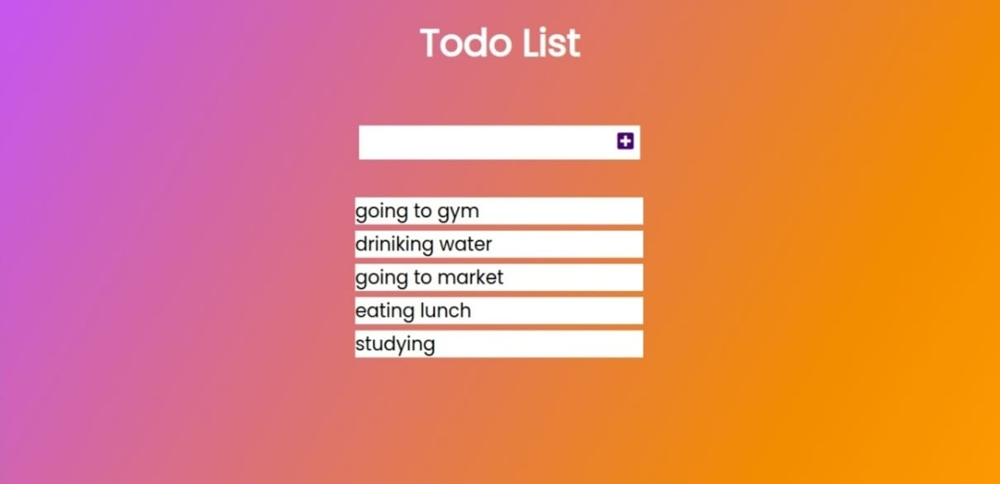

## This is my Todo list

It contains following:

1. You can add the your Todo list and it will be saved on Local Storage and you can view it on HTML page.
2. Whenever you input the wrong input like html tags, numeric, alphanumeric or an empty string, it will highlight your input box as "red" and won't append it to the Todo list.
3. If the task is done you can line-through by the "Single Click".
4. If you want to delete the task then you can "Double Click" and the task will be deleted.(also deleted from local storage).

For complete Documentation of Local storage refer this [link](https://developer.mozilla.org/en-US/docs/Web/API/Window/localStorage)

[Demo Link](https://panditaditi07.github.io/ToDo-List/.)
